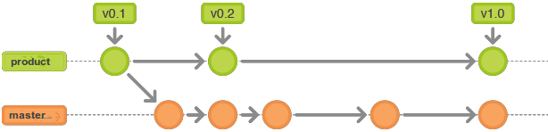
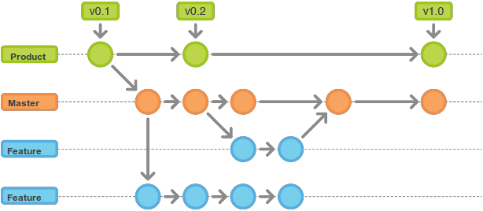

#Git workflow

##Historical branches

There are two branches to record the history of the project. 

**dev** — development branch, which serves as an integration branch for features

**production** — stores the official release history. All commits to this branch should have a tag with a version number.



##Feature branches

Each new feature should reside in its own branch, which can be pushed to the central repository for backup/collaboration. All feature branches should use `dev` as their parent branch. When a feature is complete, it gets merged back into 'dev'. Features should never interact directly with `production`.



##Release branches

Once `dev` has acquired enough features for a release (or a predetermined release date is approaching), you fork a release branch off of `dev`. Creating this branch starts the next release cycle, so no new features can be added after this point—only bug fixes, documentation generation, and other release-oriented tasks should go in this branch. Once it's ready to ship, the release gets merged into `production` and tagged with a version number. In addition, it should be merged back into `dev`, which may have progressed since the release was initiated.

Using a dedicated branch to prepare releases makes it possible for one team to polish the current release while another team continues working on features for the next release. It also creates well-defined phases of development.

###Conventions:

 - branch off: dev
 - merge into: production
 - naming convention: release-* 


##Maintenance (hotfix) branches

Maintenance or “hotfix” branches are used to quickly patch production releases. This is the only branch that should fork directly off of `production`.As soon as the fix is complete, it should be merged into both `production` and `dev` (or the current release branch), and `production` should be tagged with an updated version number.
Having a dedicated line of development for bug fixes lets the team address issues without interrupting the rest of the workflow or waiting for the next release cycle. You can think of maintenance branches as ad hoc release branches that work directly with `production`.

##Overview

###Common rules:

 - Learn Git commands;
 - Commit early and often (everyday);
 - Do make useful commit messages;
 - Branch out and sync often, new feature -> new branch;
 - Current working version of code is always in `dev`;
 - All releases are stored and tagged into `production`;
 - Use Realease tab on GitHub to create new release;
 - Use separate branch to store Release Candidate. Name of branch is release-[version number];
 - Use Pull Request to merge feature branch into `dev`;
 - Use interactive or/and local rebase to cleanup history;
 - The golden rule of `git rebase` is to never use it on public branches.
 - Delete unused (merged) feature branches.

###Git workflow:

 - Update local `dev` using: `git pull dev` 
 - Create new feature branch: `git checkout -b new_branch_name`
 - Develop new feature. do commits to feature branch.
 - Sync feature branch with `dev` (optional).
 - Use `git rebase -i HEAD~n` for local cleanup. (n - is number of commits ) (optional)
 - Send Pull Request to `dev`
 - As soon as PR is merged into `dev` remove feature branch.


##Setp by step instruction

1. Update local `dev` branch.
  ```
  git checkout dev
  git pull origin dev
  ```
  
2. For exapmle, you should fix a bug. The number of bug is — 1234. Create new branch. 
  ```
  git checkout -b 1234-bug-login
  ```
  The feature branch name template is [number]-[bug/feature]-[short_description].
  
3. Develop a new feature or fix a bug.
  ```
  git add ...list of files...
  git commit -m "#1234 changing db model" 
  ```
  
4. Do not send PR if feature is not finished. In order to keep changes you can push feature branch to remote repository.
  ```
  git push origin 1234-bug-login
  ```
  New branch will be created into remote repository.
  
  
5. When work is done the changes should incorporated into `dev` branch. Use Pull Requests to do that.
   Before sending of PR you may want to:
    - cleanup branch history to make sure that each commit in your feature is focused and meaningful, see [Local Cleanup](#local-cleanup);
    - rebase the feature onto the tip of the `dev` branch, see [Integrating an Approved Feature](#integrating-an-approved-feature).
   When/If pull request is ready to be incorporated into `dev` use rebase in order to get linear history and fast-forward merge.


##Local Cleanup

Interactive rebase allows to change branch history. This lets you write your code without worrying about breaking it up into isolated commits—you can fix it up after the fact.
When calling git rebase, you have two options for the new base: The feature’s parent branch (e.g., dev), or an earlier commit in your feature. The latter option is nice when you only need to fix up the last few commits. For example, the following command begins an interactive rebase of only the last 3 commits.
  ```
  git checkout 1234-bug-login
  git rebase -i HEAD~3
  ```
 In order to re-write the entire feature using this method, the git merge-base command can be useful to find the original base of the feature branch. The following returns the commit ID of the original base, which you can then pass to git rebase:
  ```
  git merge-base 1234-bug-login dev  
  ```
  and then:
  ```
  git rebase -i [#CommitID]
  ```
  Squash or reword commits.

##Reviewing a Feature With a Pull Request

You need to avoid using git rebase after creating the pull request. As soon as you make the pull request, other developers will be looking at your commits, which means that it’s a public branch. Re-writing its history will make it impossible for Git and your teammates to track any follow-up commits added to the feature.
Any changes from other developers need to be incorporated with git merge instead of git rebase.
For this reason, you should clean up your code with an interactive rebase before submitting your pull request.

##Integrating an Approved Feature

After a feature has been approved by the team, you have the option of rebasing the feature onto the tip of the `dev` branch before using Merge pull request to integrate the feature into the main code base.

By performing a rebase before the merge, you’re assured that the merge will be fast-forwarded, resulting in a perfectly linear history. 
This also gives you the chance to squash any follow-up commits added during a pull request.

 ```
  git fetch origin dev
  git rebase -i origin/dev 1234-bug-login
 ```
 and then push to remote repository
 ```
  # Be very careful with this command!
  git push -f origin 1234-bug-login
 ```

  > - Flag -f forced Git to overwrite the remote feature branch to match the rebased one. Never ever use it with `dev`,`production` or any other public branch. You can rebase only your own private branches.