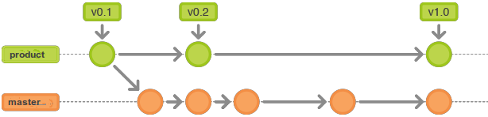
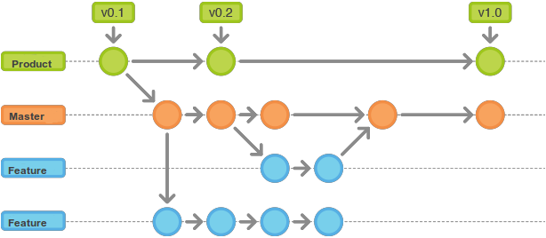
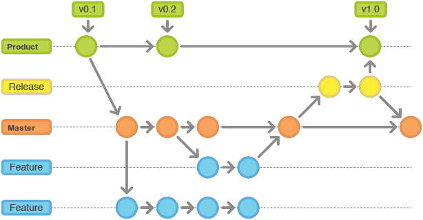
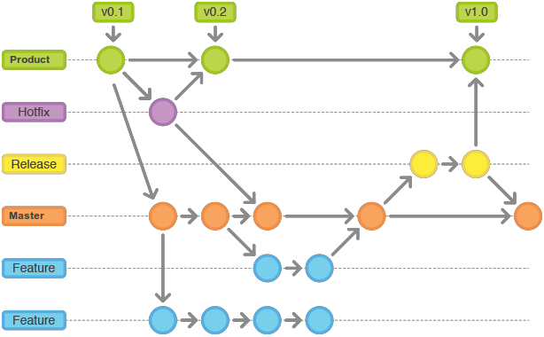
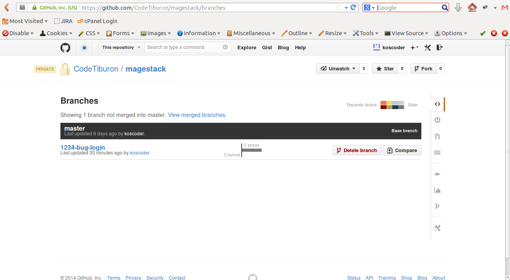
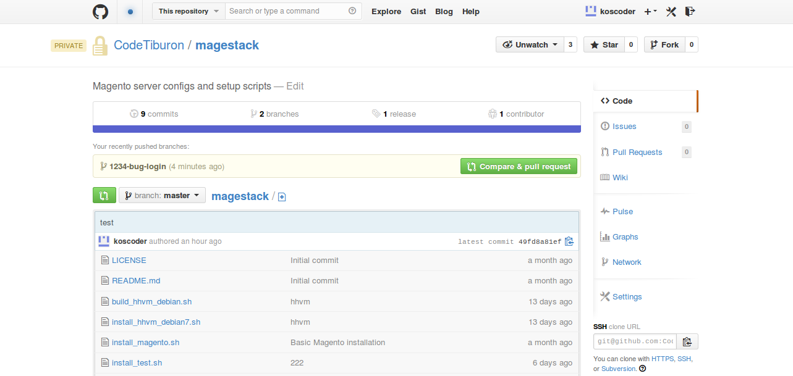
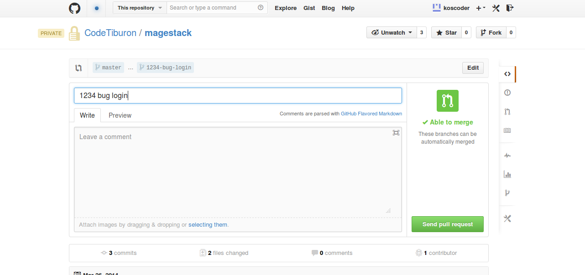
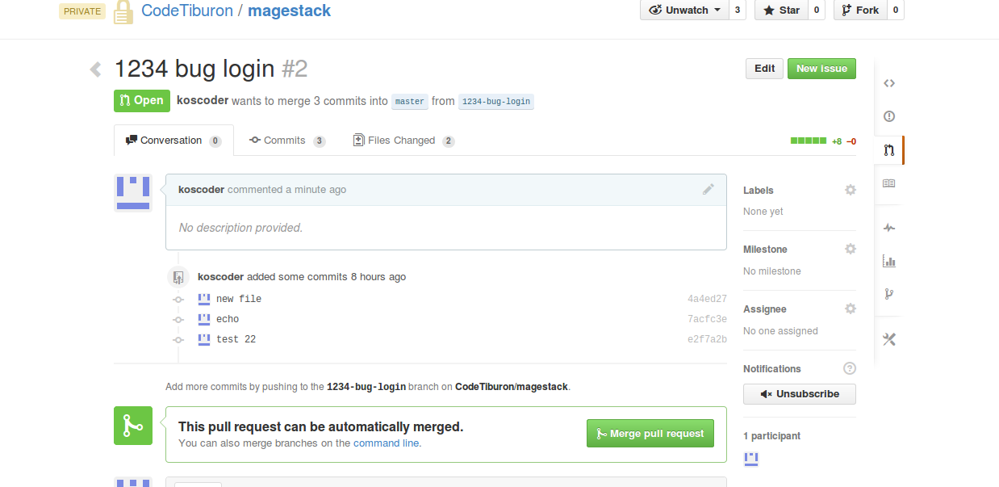

#Git workflow

##Основные ветки

**master** — основная ветка разработки проекта

**product** — ветка, в которой хранятся релизы продукта



##Feature branches

Для разработки каждой новой задачи программист должен создавать новую локальную ветку. В эту ветку программист будет комитить все изменения. Ветка должна быть создана на базе текущей ветки разработки — `master`. Когда задача закончена ветка должна быть слита с `master`.



##Release branches

Как только разработано достаточно функциональности для релиза, либо наступила предопределенная дата релиза, из master создается release branch. Создание этой ветки означает переход к следующему циклу разработки, в эту ветку не добавляют новую функциональность, только — исправления ошибок, документацию и другие задачи необходимые для релиза. Как только релиз готов для поставки все изменения сливаются в ветку product и устанавливается тег с номером версии. Кроме того, эта ветка должна быть слита с веткой master. 
Использование выделенной ветки для подготовки релиза необходимо для того, чтобы отшлифовать версию продукта не прекращая разработку новой функциональности. Названия веток должны быть в формате: release-*.



##Общее описание процесса

###Общие правила:

 - Текущая рабочая версия кода всегда хранится в ветке master
 - Все законченные релизы хранятся в ветке product (опционально) либо в `master`
 - Для обозначения релиза используется `git tag`. В GitHub есть специальная вкладка Release, в которой можно просматривать и создавать релизы.
 - Для Release Candidate используется новая выделенная ветка. Имя ветки задается в формате release-номер релиза
 - Все обновления в master, product ветках происходят через pull requests для большинства проектов и команд, либо через rebase ветки с новой функциональностью на master и последующим слиянием master с веткой — в отдельных случаях.
 - Если ветка с новой функциональностью уже слита с мастером или создан pull request ветку необходимо удалить.

###Git workflow состоит и следующих шагов:

 - Выполнить `git pull` для того, чтобы обновить локальный `master`
 - Создать ветку для новой функциональности: `git checkout -b new_branch_name
 - Разработать функционал с ранними и частыми комитами в собственную ветку.
 - Периодически обновлять локальный `master` и после делать `git rebase` на `master` для того чтобы сливать изменения из основного репозитория.
 - Сжать все локальные комиты в один или несколько c помощью `git rebase -i` (опционально)
 - Слить изменения с локальный `master` либо отправить pull request
 - Отправить изменения в основной репозитрий (push) либо слить pull request




##Процесс работы с GitHub

1. Когда программист начинает работу над новым дефектом / функционалом, он должен переключиться на ветку `master` и получить ее последнюю версию.

```
git checkout master
git pull origin master
```

2. К примеру, разработчик хочет начать исправлять дефект страницы аутентификации. Номер ошибки в Redmine, Github или Jira — 1234. Разработчик должен создать новую ветку из `master`

```
git checkout -b 1234-bug-login
1234-bug-login это только пример. Первым словом должен быть номер дефекта, вторым — bug / feature, а дальше — описание проблемы.
```

3. Далее разработчик продолжает работу локально: делает изменения, коммиты и т.д. Commit-cообщения должны содержать номер ошибки и техническое описание

```
git add ...list of files...
git commit -m "#1234 changing backbone model url" 
```

Периодически можно обновлять свою ветку из общей ветки master.

4. До тех пор пока разработка функциональности не окончена её не нужно сливать с master. Для того, чтобы сохранить изменения их необходимо отправить на Github

```
git push origin 1234-bug-login
```
В результате данной команды будет создана новая ветка в удаленном репозитории. Github позволяет просмотреть все ветки.



Все изменения теперь в репозитории в отдельной ветке, с которой можно продолжить работу на следующий день.

5. Когда разработка функционала окончена разработчику необходимо отправить изменения в ветку master. Сливание веток должно производится через Pull Request.
Для этого разработчику необходимо обновить свою ветку из master, чтобы иметь возможность слить ее без конфликтов.
Сперва необходимо получить последнюю версию master ветки

```
git checkout master
git pull origin master
```

И затем загрузить все изменения, которые произошли в master ветке, в свою ветку (1234-bug-login)

```
git checkout 1234-bug-login
git rebase master
```

Верхние 4 команды можно заменить на 2:

```
git fetch origin master
git rebase origin/master 1234-bug-login
```
Далее локальную ветку нужно загрузить в GiHub. Перед выполнением команды ниже, нужно, чтобы работа происходила обязательно в ветке для новой функцилнальности, т. е. 1234-bug-login. Для этого можно еще раз выполнить git checkout 1234-bug-login

git push -f origin 1234-bug-login

После последней команды все изменения сохранятся в ветке в репозитории на GitHub. 

Замечания
---
 - Вместо rebase можно использовать `git merge`.
 - Флаг -f необходим для того, чтобы переписать историю вашей ветки. Никогда не применяейте его для master.
 - Никогда не делайте rebase для master, т.к. эта команда изменяет историю ветки. Делайте rebase только своих веток.

6. Теперь разработчик делает Сreate Pull Request из 1234-bug-login в master ветку при помощи Github






7. Pull Request отправлен, любой разработчик может сделать code review, написать комментарии, уточнения и т.д.
Комментарии должны быть исправлены и отправлены на Github обычным способом. Pull Request обновится автоматически.

Иногда, исправления занимают некоторое время, и другие разработчики уже слили свои ветки с master. В этом случае есть 2 варианта:

- кнопка Merge pull request на Github активна. Это означает, что изменения других разработчиков не конфликтуют с текущими изменениями, и ничего дополнительного делать не требуется.
- кнопка Merge pull request неактивна. Необходимо вернуться к пункту 5) и заново слить и отправить изменения из master ветки в 1234-bug-login.

